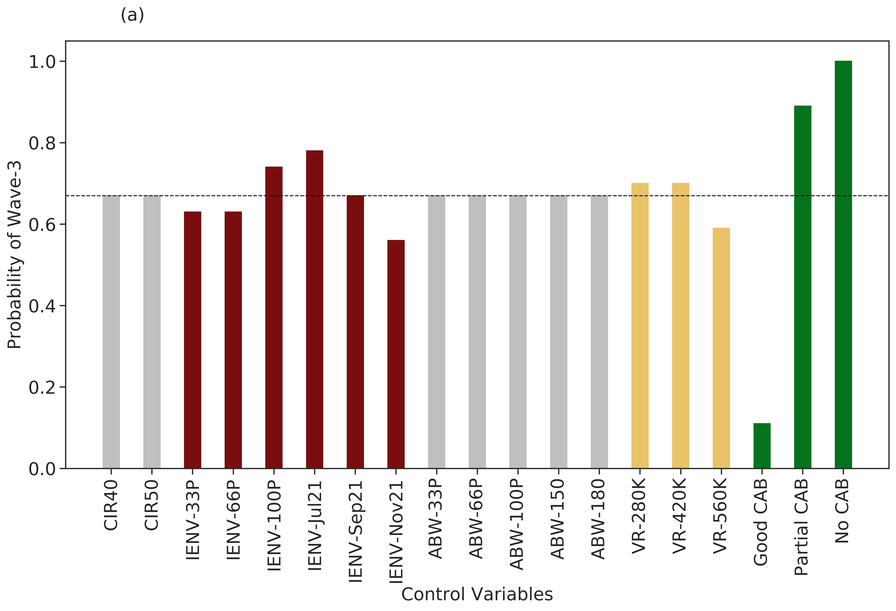
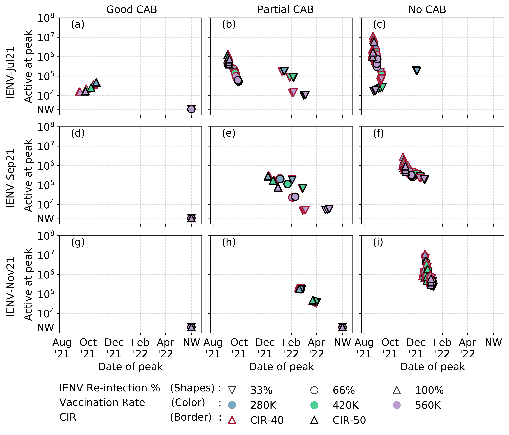
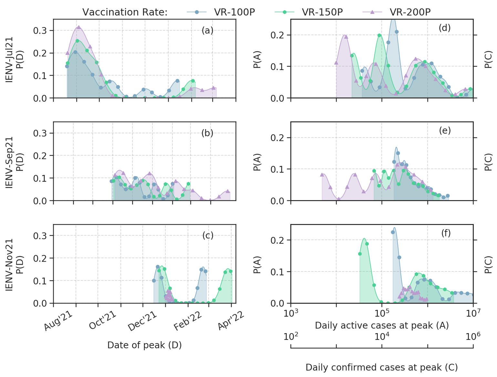
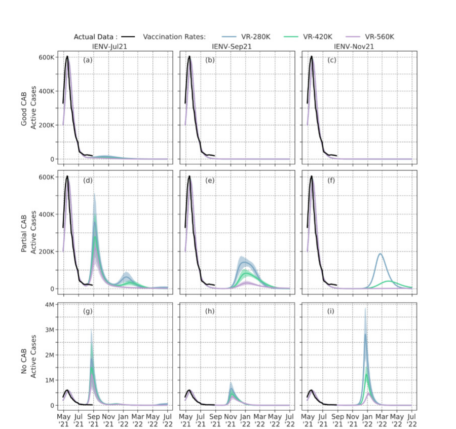

# Covid_Wave3_Prediction

Ensemble Forecast for COVID Wave-3 using IISc Model  

  **Credits: Colab notebook generated by [Divij Ghose](https://github.com/divijghose/COVID_Wave3_IISc)**

This repo contains the codes used to generate the plots requried for the ensemble forecast of covid-19 in the state of Karnataka. The enselble forecast using the [IISc Population Balance Model for infectious disease spread](https://www.nature.com/articles/s41598-021-86084-7). The ensemble forecast uses 972 different scenarios of results generated by varying parameters such as vaccination rates, Case to Infection ratio, Mutation of Virus etc. 

## PrePrint
---

Ensemble forecast of COVID-19 in Karnataka for vulnerability assessment and policy interventions  
[Sashikumaar Ganesan](http://cds.iisc.ac.in/faculty/sashi/), [Deepak Subramani](http://cds.iisc.ac.in/faculty/deepakns/), **Thivin Anandh**, [Divij Ghose](divijghose.github.io), Giridhar Babu

* [colab](https://colab.research.google.com/github/divijghose/COVID_Wave3_IISc/blob/master/COVID_Wave3_Ensemble.ipynb)
* [github](https://github.com/divijghose/COVID_Wave3_IISc)
* [medrXiv](https://www.medrxiv.org/content/10.1101/2021.08.31.21262943v1)

## Plots

Note: Color indicates the median of Active cases at peak and value indicates the probablity of occurence of wave 3 given scenarios.

Probability of occurance of wave-3 based on different control parameters.

